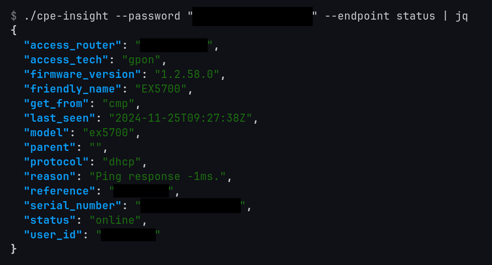

This only supports requesting the GET endpoints of the API, but not these:
```
/${t}/telemetry-historic/${e}
/${t}/forgot-password/change/${e}/${r}
```

It sends requests to `https://wifi.telenor.no`

## TODO
Identify the CPE Insight API version and warn on stderr if not supported, ensure only containing digits and '.'
